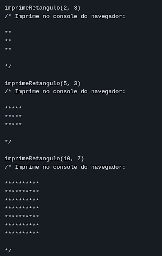

# Assesment - Javascript I

## Exercício 1: Qual o seu nome?

Crie um código que utilize a função `prompt` para perguntar ao usuário “Qual o seu nome?”. O texto que foi digitado no prompt deve ser guardado em uma variável nomeada `nomeUsuario`.

Use a função `console.log` para imprimir o valor `nomeUsuario` no console.

## Exercício 2: Trabalhando com adição e subtração

Crie um programa que guarde em uma variável `resultadoOperacao` o resultado do seguinte cálculo matemático:

```javascript
3 - 5 + 10 - 13 + 1
```

Depois, mostre esse resultado na tela através de um `alert` e de um `console.log`.

## Exercício 3: Trabalhando com multiplicação

Crie um programa que guarde em uma variável `resultadoOperacao` o resultado do seguinte cálculo matemático:

```javascript
10 / 5 + 10 - 5 * 5
```

Depois, mostre o valor armazenado nesta variável através de um `console.log`.

## Exercício 4: Número inteiro aleatório no console

Crie um programa que gere um número aleatório entre 0 e 10. Mostre esse valor em um `console.log`.

## Exercício 5: Operações matemáticas com números do prompt

Crie um programa que faça o seguinte:

1. Solicite um valor através de um `prompt`, converta-o para número e guarde o valor em uma variável `primeiroNumero`;
2. Solicite um segundo valor através de um `prompt` (deve ser um número), converta-o para número e guarde o valor em uma variável `segundoNumero`;
3. Mostre em um único `alert` o resultado da soma, subtração, divisão e multiplicação entre `primeiroNumero` e `segundoNumero`, no seguinte formato:

```
Soma: RESULTADO_AQUI
Subtração: RESULTADO_AQUI
Multiplicação: RESULTADO_AQUI
Divisão: RESULTADO_AQUI
```

O resultado de cada operação deve ficar em uma linha diferente no `alert`!

## Exercício 6: Nome e idade, só que com os tipos

Faça um programa que solicite via `prompt` o nome (string) e a idade (number) do usuário. Guarde esses valores nas variáveis `nome` e `idade`, respectivamente. Por fim, mostre `nome` e `idade` através de `alert`, e os tipos desses valores (`typeof`) em `console.log`.

## Exercício 7: Gerar um número inteiro aleatório no alcance estipulado

Solicite um número inteiro via `prompt`, e guarde-o em uma variável chamada `numeroCentro`. Depois, solicite um segundo número inteiro via `prompt` e guarde-o em uma variável chamada `distancia`. Assuma que o usuário sempre irá digitar números inteiros maiores do que zero. Não há necessidade de validar.

Depois, faça uma lógica para gerar um número inteiro aleatório baseado nos valores de `numeroCentro` e `distancia`, através da seguinte lógica:

- Se `numeroCentro` é 10 e `distancia` é 3, gerar números aleatórios entre 7 e 13 (7, 8, 9, 10, 11, 12, 13);
- Se `numeroCentro` é 7 e `distancia` é 2, gerar números aleatórios entre 5 e 9 (5, 6, 7, 8, 9).
- Se `numeroCentro` é 2 e `distancia` é 1, gerar números aleatórios entre 1 e 3 (1, 2, 3).
- E assim por diante…

Ou seja, `numeroCentro` é uma “base” e `distancia` determina o intervalo de números possíveis. Por fim, mostre o número aleatório gerado no console do navegador.

## Exercício 8: Valores truthy e falsy

Faça um programa que mostre no console do navegador três exemplos de valores truthy e três exemplos de valores falsy.

## Exercício 9: Descobrindo o dia da semana

Utilize `switch/case` para resolver essa questão!

Crie um programa que determina o nome do dia da semana com base em um número fornecido. O número representará o dia da semana, onde 1 é segunda-feira e 7 é domingo. Mostre essa informação através de um `console.log`.

## Exercício 10: Verificação de Acesso

Utilize o operador ternário para resolver essa questão!

Utilize `if/else` para resolver essa questão!

Você está criando um pequeno script para verificar se um usuário pode acessar uma área restrita de um site. As condições para acesso são:

1. O usuário deve ter pelo menos 21 anos. Solicite a informação via `prompt`, guarde em uma variável chamada `idade` como um número.
2. O usuário deve ser um membro premium. Solicite a informação via `prompt`, assumindo os valores “Sim” para true e “Não” para false, guarde em uma variável chamada `isPremium` como um boolean). Se o usuário digitar alguma coisa diferente de “Sim” ou “Não” finalize o programa com um erro. Implemente essa lógica utilizando `if/else`.

Após, utilizando o operador ternário, guarde em uma variável chamada `isAcessoConcedido` os valores true ou false dependendo se ele possui o acesso ou não conforme as regras supracitadas. Por fim, mostre `isAcessoConcedido` no console do navegador.

## Exercício 11: Classificação de Produtos

Você está desenvolvendo um sistema de classificação de produtos e precisa determinar a categoria de um produto com base em seu preço e se ele está em promoção, assumindo o valor “Sim” para true e qualquer outro valor para false, guarde em uma variável chamada `isPromocao` como um boolean).

Para tanto, solicite o valor do produto via `prompt`, guarde como um número em uma variável `valorDoProduto`. Também pergunte via `prompt` se o produto está em promoção.

As categorias são definidas da seguinte forma:

- **"Barato"**: O produto custa menos de R$200 e não está em promoção.
- **"Moderado"**: O produto custa entre R$200 e R$3000 e está em promoção.
- **"Caro"**: O produto custa mais de R$3000, independentemente de estar ou não em promoção.

Você deve escrever um código que determine a categoria do produto e mostre a informação em um `alert`.

## Exercício 12: Calculando seu ano e mês de nascimento

Faça um programa que solicite (prompt) as seguintes informações:

1. O ano atual (`anoAtual`);
2. O mês atual (`mesAtual`) (número do mês. Exemplo: janeiro é 1, fevereiro é 2, dezembro é 12, etc.);
3. Sua idade (`idade`);
4. Quantos meses faltam para seu mês de aniversário (`mesesAteAniversario`). Por exemplo, se é fevereiro (2) e você faz aniversário em abril (4), faltam 2 meses até o seu aniversário). Utilize um número negativo caso o mês do seu aniversário já tenha passado (por exemplo, se é junho (6) e você fez aniversário em fevereiro (2), a entrada deve ser -4).

Depois, realize a subtração entre o ano atual e a idade informada para obter o ano de nascimento. Guarde essa informação em uma variável `anoNascimento`.

Quanto ao mês de nascimento, utilize um `if / else` para realizar uma adição ou subtração dependendo se `mesesAteAniversario` é um número negativo ou positivo (`mesesAteAniversario < 0`). Guarde essa informação em uma variável `mesNascimento`.

Por fim, mostre em uma popup o ano e o mês de nascimento concatenados como string no seguinte formato:

```
“O ano de nascimento é 1990 e o mês de nascimento é 12”
```

## Exercício 13: Função converte reais para centavos

Crie uma função que receba um parâmetro `valor`, do tipo número. Assumindo que `valor` esteja representado em reais, faça com que essa função retorne esse número convertido para centavos.

Exemplo:

```javascript
const resA = reaisParaCentavos(2.5); //R$ 2,50
console.log(resA); //Mostra o número 250 no console.

const resB = reaisParaCentavos(3); //R$ 3,00
console.log(resB); //Mostra o número 300 no console.
```

## Exercício 14: Função para comparar strings

Utilize o arquivo `script.js` para solucionar essa questão.

Crie uma função chamada `comparaStringCaseInsensitive`, que deve receber os parâmetros `strA` e `strB`, ambos do tipo string. A função deve retornar `true` caso `strA` seja igual a `strB`. Caso contrário, deve retornar `false`.

Além disso, a função deve retornar `true` mesmo que as caixas das strings sejam diferentes. Por exemplo, caso `strA` seja "tEste" e `strB` seja "Teste", a função deve retornar `true`.

Dica: converta as strings para minúsculas (`toLowerCase`) antes de realizar a comparação. É o jeito mais fácil de resolver!

Crie três testes como parâmetros diferentes para demonstrar o funcionamento da função.

## Exercício 15: Função raiz quadrada


Crie uma função chamada `raizQuadrada`, que deve receber um parâmetro `numero` e retornar a raiz quadrada desse número. Utilize a função `Math.sqrt` para fazer isso.

Faça três testes chamando a função `raizQuadrada` e mostrando o resultado no `console.log`.

## Exercício 16: Função para somar dois números

Crie uma função chamada `soma`, que deve receber dois parâmetros `a` e `b` e retornar a soma desses dois números. Em seguida, crie três testes chamando a função `soma` com diferentes valores e mostre o resultado no `console.log`.

