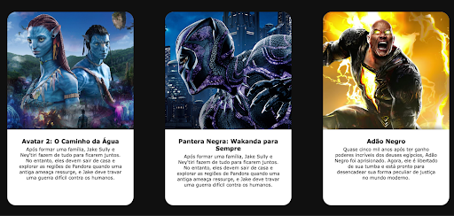
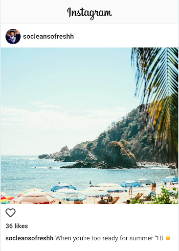
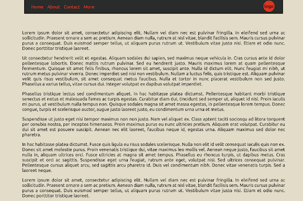
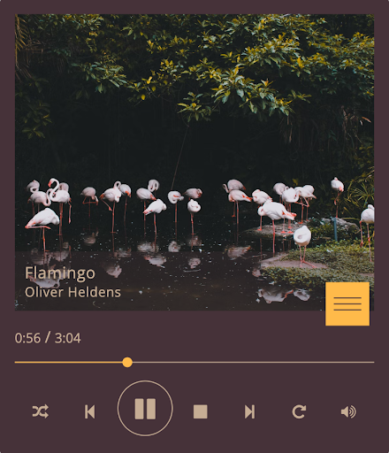

# Tarefas de HTML e CSS

## [Tarefa 01: Tags Semânticas](questao_1/index.html)

Estruture um documento HTML com tags semânticas do HTML5. No mínimo, utilize 5 tags semânticas. Defina cores de fundo diferentes para cada tag. Adicione conteúdo ou altere o tamanho do elemento HTML para tornar possível a sua visualização no navegador.

## [Tarefa 02: Estilizando Parágrafos](questao_2/index.html)

Estruture um documento HTML com 4 parágrafos contendo textos diferentes. Estilize cada parágrafo de forma única, sem repetição, alterando a visualização dos parágrafos no navegador. Use seletores para distinguir os parágrafos e estilize-os numa folha de estilos externa ao documento HTML.

## [Tarefa 03: Tipografia](questao_3/index.html)

Copie o código do exercício anterior e use 4 tipografias diferentes do Google Fonts, uma para cada parágrafo.

## [Tarefa 04: Tipografia Incorporada](questao_4/index.html)

Estruture um documento HTML com 3 parágrafos e um título. Faça o download e incorpore ao seu projeto 3 famílias tipográficas diferentes. Vincule a cada parágrafo uma família tipográfica diferente via CSS em uma folha de estilo externa ao seu documento HTML.

## [Tarefa 05: Listas, Listas e Listas](questao_5/index.html)

Estruture um documento HTML com 3 listas estilizadas:
- Uma lista ordenada
- Uma lista não ordenada
- Uma lista de definição

Cada lista deve possuir, no mínimo, 6 itens. O conteúdo das listas deve conter:
- Suas preferências musicais (lista ordenada)
- Suas preferências gastronômicas (lista não ordenada)
- Canais onde você consome informação na web, detalhando-os (lista de definição).

## [Tarefa 06: Navegação](questao_6/index.html)

Estruture um documento HTML com tags para navegação guiada para itens externos ao seu projeto. Forneça links para:
- A página do Infnet
- A página da Globo.com
- A página do LinkedIn
- A página do YouTube
- A página do Instagram

O conteúdo do hiperlink deve ser representado pela combinação de ícone e texto, conforme o exemplo a seguir:

## [Tarefa 07: Header e Nav](questao_7/index.html)

Estruture um documento HTML com tags semânticas do HTML5 para cabeçalho e navegação. O cabeçalho deve conter um logotipo representando a marca. A navegação deve ter 5 elementos:
- Home
- Lojas
- Cardápio
- Promoções
- Contato

Estilize o elemento de navegação e centralize o cabeçalho e a navegação.

## [Tarefa 08: Main](questao_8/index.html)

Estruture um documento HTML a partir do exercício anterior. Defina abaixo da navegação um contêiner principal, contendo:
- Um título
- 3 vídeos: um incorporado do YouTube, um incorporado de um arquivo presente na sua estrutura raiz de arquivos do projeto, e o último com link direto da web.

## [Tarefa 09: Desenvolvendo Páginas Simples](questao_9/index.html)

Estruture um documento HTML com a estilização necessária para reproduzir visualmente o conteúdo a seguir:
- Observe a centralização dos elementos.
- Trabalhe a proporção de título, texto e imagem.
- A borda é meramente ilustrativa.

## [Tarefa 10: Cards](questao_10/index.html)

Estruture um documento HTML para a criação de um ou mais cards conforme o exemplo a seguir. Cada card deve conter:
- Imagem
- Título
- Descrição

## [Tarefa 11: Desenvolvendo Páginas Simples](questao_11/index.html)

Reproduza a postagem exemplo do Instagram, definindo títulos e suas hierarquias, imagens e ícones. Observe o peso da tipografia em cada texto entregue. Limite o seu container a 600px de largura.

## [Tarefa 12: Desenvolvendo Páginas Simples](questao_12/index.html)

Reproduza o layout a seguir com container pai limitado a 992px. O elemento de navegação deve seguir o proposto, com logotipo à direita. Os textos devem estar justificados. Estilize as cores de acordo com a sua escolha.

## [Tarefa 13: Seletores CSS](questao_13/index.html)

Estruture um documento HTML com parágrafos descrevendo cada um dos 6 possíveis seletores e suas chamadas no CSS. Dê exemplos ativos dos seletores em funcionamento, estilizando cada um de forma diferente.

## [Tarefa 14: Ancorando Identificadores](questao_14/index.html)

Estruture um documento HTML para praticar a criação de links que direcionam o usuário para diferentes seções da mesma página HTML. Crie um cabeçalho com um título chamado "Minha Página com Âncoras". Abaixo do título, crie uma lista de navegação com links que direcionam o usuário para três seções diferentes da página:
- Um link chamado "Sobre Mim" que leva a uma seção de descrição pessoal.
- Um link chamado "Meus Hobbies" que leva a uma seção sobre hobbies.
- Um link chamado "Contato" que leva a uma seção de informações de contato.

Abaixo do menu de navegação, crie três seções diferentes: Sobre Mim, Meus Hobbies e Contato. Cada seção deve conter o título da seção, um parágrafo detalhando o necessário para a seção e um identificador da seção. Faça a âncora apontar para o identificador da seção desejada e teste seu funcionamento. No final das seções, crie uma âncora para retornar ao topo da página. Adicione um identificador no cabeçalho que servirá para ancorar o retorno ao topo.

## [Tarefa 15: Tags Semânticas](questao_15/index.html)

Estruture um documento HTML com duas âncoras específicas:
- A primeira âncora para efetuar o download de um arquivo.
- A segunda âncora para envio de e-mail.

## [Tarefa 16: Reprodução de Music Player](questao_16/index.html)

Estruture um documento HTML para reproduzir o player abaixo. Limite seu contêiner principal a 576px. Use ícones do Google Fonts. Escolha as cores e imagens.

