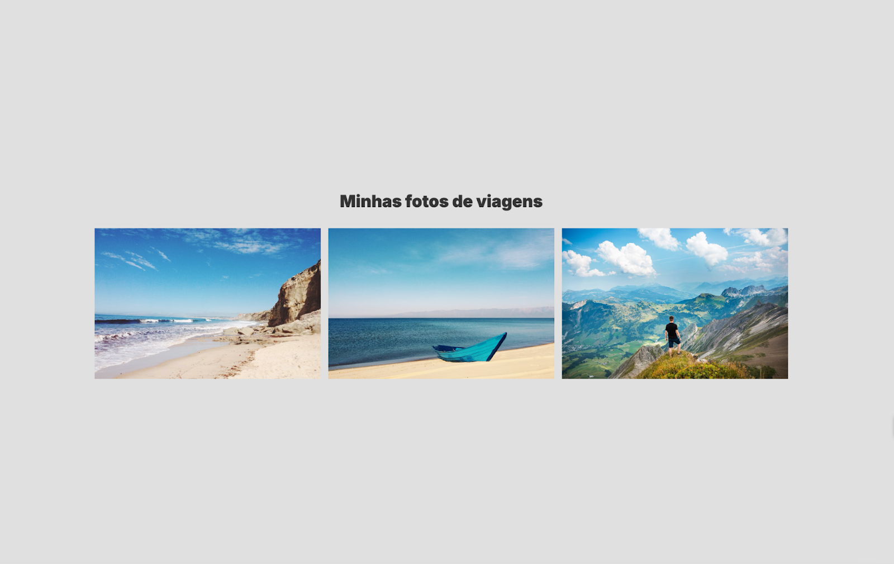
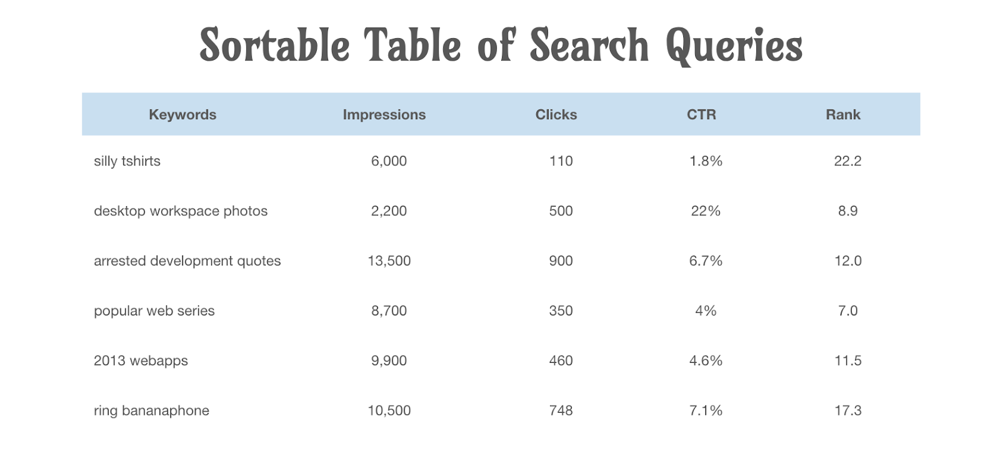
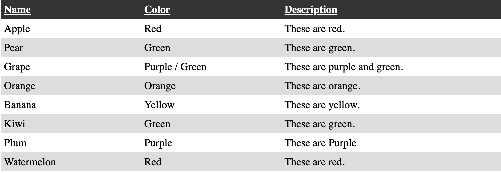
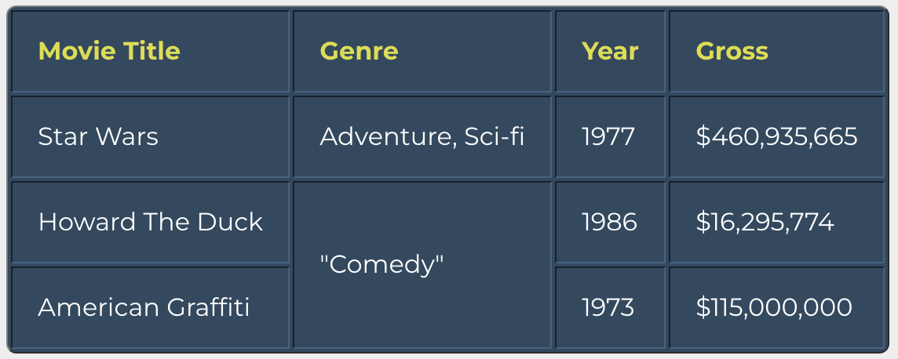
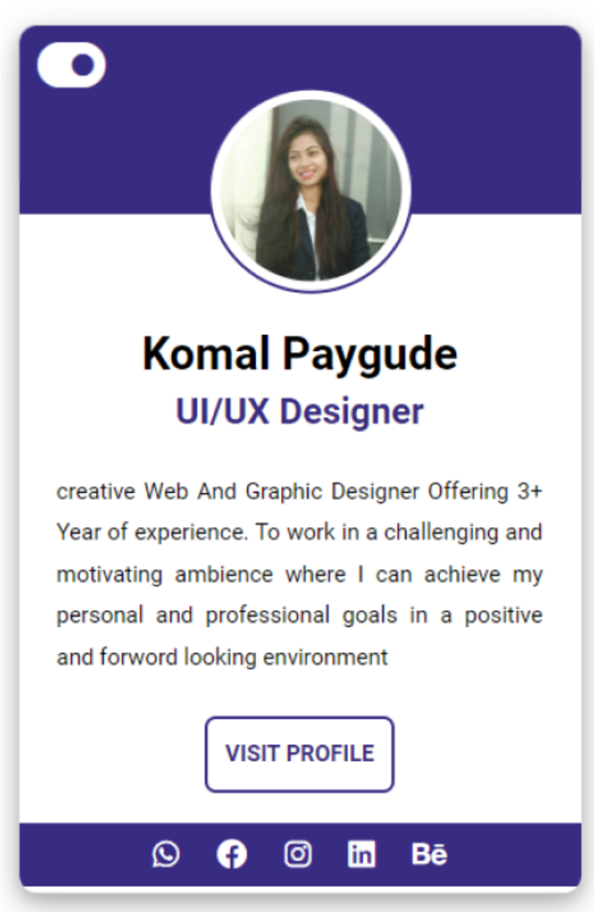
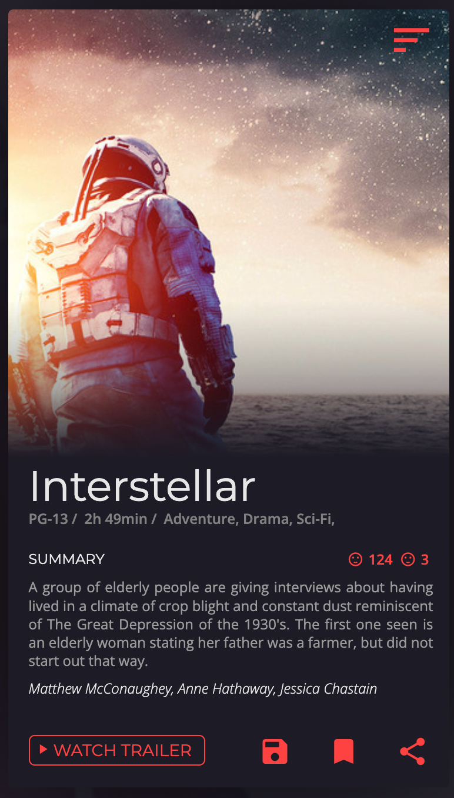
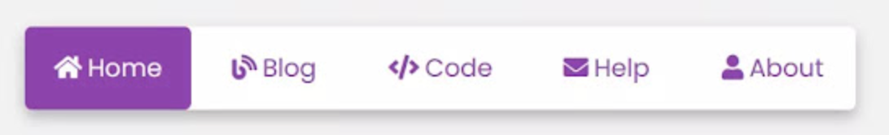
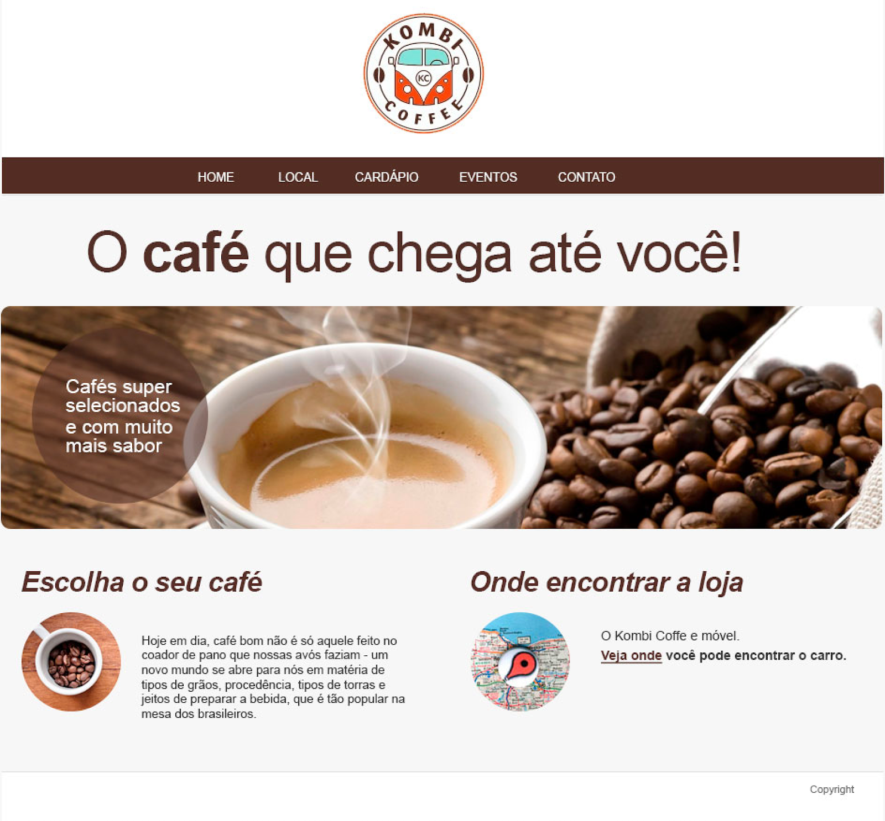

# 3º Teste de Performance - HTML e CSS

# Tarefas de Programação Web

## Tarefa 01: Layout de Galeria Simples
Estruture um documento com HTML5, estilize com CSS3, buscando reproduzir a imagem abaixo. Defina 3 imagens com o mesmo tamanho, entregues lado a lado, contendo um título.

## Tarefa 02: Tabelas Sim!
Crie um documento HTML com tabela idêntica ao exemplo a seguir. Você pode alterar o conteúdo, mas deve manter a estrutura, exibição e estilização.

## Tarefa 03: Tabelas Sim!
Crie um documento HTML com tabela idêntica ao exemplo a seguir. Você pode alterar o conteúdo, mas deve manter a estrutura, exibição e estilização. Desenvolva estilos para exibição dos dados de cabeçalho e linhas zebras.

## Tarefa 04: Tabelas Sim!
Reproduza a tabela a seguir, alterando o conteúdo, mas mantendo a estrutura, exibição e estilização. Desenvolva estilos para exibição dos dados de cabeçalho e linhas.

## Tarefa 05: Cards
Crie um documento HTML, recriando a estrutura proposta da imagem a seguir, para elementos de um card profissional. Você pode promover alteração das cores e ícones, respeitando o padrão visual entregue na imagem. Configure os links âncoras para páginas reais.

## Tarefa 06: Cards
Crie um documento HTML, recriando a estrutura proposta da imagem a seguir, para elementos de um card profissional. Você pode promover alteração das cores e ícones, respeitando o padrão visual entregue na imagem. Escolha algum filme ou série de sua preferência para reproduzir.

## Tarefa 07: Navbar com Ícones
Crie um documento HTML para reproduzir a estrutura e estilização da navbar proposta. Defina estados, como hover, por exemplo. Não deixe de usar ícones.

## Tarefa 08: Vídeo
Crie um documento HTML e insira 3 vídeos:

- Um vídeo incorporado de alguma plataforma de streaming;
- Um vídeo com source de algum endereço na web;
- Um vídeo com source de arquivo incorporado diretamente do seu projeto.

## Tarefa 09: Vídeo
Crie um documento HTML e insira 1 vídeo com controles, áudio mutado, repetição ativa e início da exibição automática. Insira um pôster para a capa do vídeo.

## Tarefa 10: Áudio
Crie um documento HTML e insira 3 áudios com controles.

- Um áudio incorporado diretamente do seu projeto;
- Um áudio com source de algum endereço na web;
- Um áudio com 3 sources com arquivos incorporados diretamente do seu projeto.

---

# Projeto Kombi Coffee - Etapas em Grupo

Nas tarefas 11 a 16, você vai trabalhar em grupo para reproduzir o layout proposto. Para apoiar a execução, segue o arquivo zip contendo imagens e textos. Você tem a liberdade de alterar cores, tipografias e imagens.

## Tarefa 11: Reprodução de Layout - Grupo
Crie um documento HTML e estruture o layout com tags semânticas: Header, Nav, Main, Section e Footer.

## Tarefa 12: Continuação de Reprodução de Layout - Grupo
Continue o seu projeto e:

- Crie uma folha de estilos `estilos.css`.
- Insira uma tag H1 antes da imagem do logo (dentro do HEADER) com o texto: Kombi Coffee.
- Oculte o conteúdo da tag H1 com CSS.
- Envolva todo o conteúdo dentro do body numa tag DIV com Id Container.
- Formate o contêiner centralizado na página, com largura de 992px, pelo CSS.

## Tarefa 13: Continuação de Reprodução de Layout - Grupo
Continue o seu projeto e:

- Crie o elemento de navegação com uma lista não ordenada, contendo as âncoras para novas páginas, mesmo que não criadas.
- Formate o elemento de navegação com CSS. Use a técnica necessária para centralizar os itens, criar área de respiro entre eles e formatar a sua aparência de acordo com a proposta.

## Tarefa 14: Continuação de Reprodução de Layout - Grupo
Continue o seu projeto e:

- Crie o elemento `main` para o seu conteúdo principal.
- Aplique uma imagem para a área de destaque do seu projeto (Hero), contendo dentro dela, via código HTML e estilização CSS, o texto apresentado: “Cafés super selecionados e com muito mais sabor”.

## Tarefa 15: Continuação de Reprodução de Layout - Grupo
Continue o seu projeto e:

- Ainda dentro do main, crie duas seções para as áreas **Escolha o seu café** e **Onde encontrar as lojas**.
- As seções devem estar lado a lado, conforme a proposta.

## Tarefa 16: Continuação de Reprodução de Layout - Grupo
Continue o seu projeto e:

- Na seção **Onde encontrar as lojas**, substitua o ícone por um iframe do Google Maps, com tamanho personalizado de 300px de altura por 400px de largura.
- Coloque o texto abaixo do mapa.
- O endereço do mapa deve apontar para o endereço do Infnet: Rua São José, 90, Centro - RJ.
- Crie um elemento `footer` e insira como conteúdo o seu nome e a frase “TP3 - Programação Web”.
