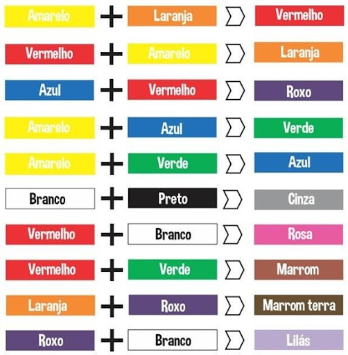
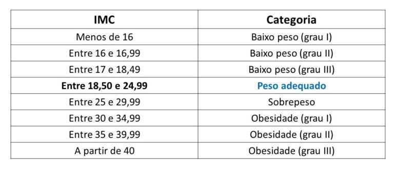

# 3º Teste de Performance

## [1. Entendendo os operadores de igualdade/diferença](questao_1/script.js)
No arquivo `script.js`, utilize comentários para explicar a diferença entre os operadores de igualdade/diferença simples e estrita. Mostre dois exemplos onde ocorre uma diferença nessa comparação.

## [2. Diga olá para os jovens!](questao_2/script.js)
Faça um programa que peça a idade do usuário através de um prompt. Caso a idade digitada seja menor do que 18 anos, mostre um alert na tela com a mensagem "Olá jovem!". Caso contrário, mostre a mensagem "Olá adulto!".  
Utilize `if / else` para implementar essa lógica!

## [3. O poder de luta de Kakarotto](questao_3/script.js)
Crie um programa que faça a seguinte pergunta através de um prompt: "Qual o poder de luta de Kakarotto?" Guarde essa resposta em uma variável `poderDeLuta`, que deve ser convertida para um número inteiro. Depois, utilize `if / else` para criar o seguinte comportamento:
- Se `poderDeLuta` for maior do que 8000, mostre um alert com a mensagem "Isso deve ser um engano, esse aparelho deve estar quebrado!"
- Caso contrário, mostre em um alert a mensagem "Ainda não é o suficiente para derrotar Vegeta!"

## [4. Laranjas, maçãs e bananas](questao_4/script.js)
Faça um programa que solicite o nome de uma fruta através de um prompt. Baseado na entrada do usuário, implemente a seguinte lógica:
- Se o usuário digitou "laranja", mostre a mensagem "Não esqueça de descascar!";
- Se o usuário digitou "maçã", mostre a mensagem "Se você tirar a casca, perderá as vitaminas!";
- Se o usuário digitou "banana", mostre a mensagem "Já vem naturalmente embalada e pronta para o consumo!";
- Caso o usuário tenha digitado qualquer outra coisa, mostre a mensagem "Não tenho nada a dizer sobre isso."

Utilize `if / else / else if` para implementar essa lógica!

## [5. Mostrando os números por extenso](questao_5/script.js)
Faça um programa que receba números de 0-9 através de um prompt (converta-os para `number`). Após, utilize `switch / case` para exibir esses números por extenso através de um alert, conforme a lógica a seguir:
- Digitou 0, mostra "zero" em um alert;
- Digitou 1, mostra "um" em um alert;
- Digitou 2, mostra "dois" em um alert;
- Digitou 3, mostra "três" em um alert;
- Digitou 4, mostra "quatro" em um alert;
- Digitou 5, mostra "cinco" em um alert;
- Digitou 6, mostra "seis" em um alert;
- Digitou 7, mostra "sete" em um alert;
- Digitou 8, mostra "oito" em um alert;
- Digitou 9, mostra "nove" em um alert;
- Digitou qualquer outra coisa, mostra "Número desconhecido" em um alert.

## [6. Desafio das cores](questao_6/script.js)
Mostre que você manja dos booleanos! Implemente a seguinte lógica de mistura de cores em JavaScript:
- Receba duas cores através do prompt e, conforme essa lógica de mistura de cores, utilize `if / else` para mostrar em um alert a cor resultante.

## [7. Mantendo o estilo](questao_7/script.js)
Faça um programa que tenha o seguinte comportamento:
- Receba uma string via prompt e guarde o conteúdo digitado em uma variável `camiseta`;
- Receba uma string via prompt e guarde o conteúdo digitado em uma variável `calca`;
- Se `camiseta` for igual a "vermelha" e `calca` for igual a "amarela", mostre em um alert a mensagem "Ketchup e mostarda!";
- Se `camiseta` for igual a "amarela" e `calca` for igual a "preta", mostre em um alert a mensagem "Agora você é uma abelha!";
- Se `camiseta` for igual a "branca" e `calca` for igual a "jeans", mostre em um alert a mensagem "Look clássico! Não tem como errar";
- Caso contrário, mostre em um alert a mensagem "Hmm, nada a comentar...!".

## [8. Função mostra o tamanho da string](questao_8/script.js)
Crie uma função que receba um parâmetro `str` do tipo string e mostre em um alert a quantidade de caracteres dessa string.

## [9. Função par ou ímpar](questao_9/script.js)
Crie uma função que receba um parâmetro `num` do tipo número e retorne uma string indicando se esse número é par ou ímpar.  
**CONSIDERE SOMENTE OS NÚMEROS INTEIROS!**

## [10. Função número extenso para algarismo](questao_10/script.js)
Crie uma função chamada `wordToNumber`, que receba uma string chamada `num` como parâmetro. Assumindo que o valor de `num` sempre vai ser um dos números de 0-9 por extenso ("um", "dois", "três", "quatro", "cinco", "seis", "sete", "oito", "nove"), faça com que essa função retorne o algarismo respectivo a esse valor.

## [11. Função converte horas para segundos](questao_11/script.js)
Crie uma função que receba um parâmetro `nHoras`, do tipo número. Assumindo que `nHoras` esteja representado em horas, faça com que essa função retorne esse número convertido para segundos.

## [12. Grupo - Cálculo de descontos](questao_12/script.js)
Uma loja está em promoção e fornece 20% de desconto para gestantes, 15% de desconto para aposentados e 10% para pensionistas. Esses descontos são aplicados se o valor da compra for maior ou igual a R$ 80,00. Se o valor da compra for abaixo de R$ 80,00, o desconto é 15% para gestantes, 10% para aposentados e 5% para pensionistas. No arquivo `script.js`, siga as etapas abaixo:
- Crie uma aplicação que solicite o valor total da compra efetuada e um código que identifique se o comprador é:
    - Gestante (A)
    - Aposentado (B)
    - Pensionista (C)
- A aplicação deve retornar o valor final da compra de acordo com o tipo de consumidor.
- Caso o tipo de consumidor não exista, exibir uma mensagem informando erro e não exibir o valor da compra do usuário.

## [13. Grupo - Cálculo de IMC](questao_13/script.js)
Tendo como dados de entrada a altura e o peso de uma pessoa, construa um algoritmo que calcule seu IMC, utilizando a seguinte fórmula:

IMC = peso / (altura * altura)

No arquivo `script.js`, siga as etapas abaixo:
- Crie uma aplicação que solicite ao usuário a altura e o peso.
- A aplicação deve informar o IMC do usuário e em qual classificação o usuário se encontra, seguindo esta imagem:
  .

## [14. Grupo - Ordenação numérica](questao_14/script.js)
No arquivo `script.js`, siga as etapas abaixo:
- Crie uma aplicação que solicite ao usuário 4 valores: X, A, B e C, onde X é um número inteiro e positivo e A, B e C são quaisquer valores reais.
- O programa deve escrever os valores lidos e:
    - Se `x=1`, escreva os três valores `A`, `B` e `C` em ordem crescente.
    - Se `x=2`, escreva os três valores `A`, `B` e `C` em ordem decrescente.
    - Se `x=3`, escreva os três valores `A`, `B` e `C` de forma que o maior fique entre os outros dois.
    - Caso contrário, exiba uma mensagem indicando que o valor de `x` não corresponde a nenhuma das condições acima.

## [15. Grupo - Eleições para mascote](questao_15/script.js)
Um time de e-sports tem duas opções para mascote, o RoboRat e o SuperKeyboard. No arquivo `script.js`, siga as etapas abaixo:
- Crie uma aplicação que solicite ao usuário a quantidade de votos recebida por cada mascote, mais a quantidade de votos inválidos.
- Informe a porcentagem de votos de cada mascote e a porcentagem de votos inválidos.
- Informe também a porcentagem de votos de cada mascote, considerando apenas os votos válidos.
- Informe qual será o novo mascote do time.

## [16. Grupo - Receita para café](questao_16/script.js)
Crie uma aplicação que apresente para o usuário, um passo a passo para fazer um café. No arquivo script.js, siga as etapas abaixo:
- Utilize o switch, para resolver o exercício.
- Permita que o usuário escolha o passo, que deseja receber as instruções. Por exemplo: Supondo que haja 10 passos para o processo, que ele possa escolher ver apenas do passo informado em diante.
- Considere que o café deverá ainda ser torrado e moído pela máquina de café.