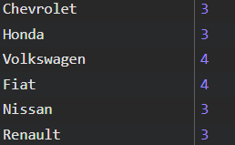

# Programação Web com JavaScript II

## 1. [Dobrar o vetor de números](questao_1/script.js)
   - O vetor de números já foi criado no arquivo `script.js`!
   - Utilizando `for…of`, crie um novo vetor de números com os “dobros” do vetor `algunsNumeros`. Mostre esse vetor no console do navegador.

## 2. [Manter os números primos do vetor de números](questao_2/script.js)
   - O vetor de números já foi criado no arquivo `script.js`!
   - Utilizando `while`, modifique o vetor `algunsNumeros` de modo a manter somente os números primos. Mostre esse vetor no console do navegador.

## 3. [Realizar o somatório dos vetores de números](questao_3/script.js)
   - Os vetores de números já foram criados no arquivo `script.js`!
   - Utilizando `for`, realize o somatório dos números de todos os vetores do arquivo `script.js`. Mostre esse número no console do navegador.

## 4. [Filtrar os produtos mais baratos](questao_4/script.js)
   - O vetor de produtos já foi criado no arquivo `script.js`!
   - Crie um novo vetor de produtos que tenha somente os 3 produtos mais baratos do vetor `produtosGamers`. Mostre esse vetor no console do navegador.

## 5. [Encontrar o ano de lançamento do filme solicitado](questao_5/script.js)
   - O vetor de filmes já foi criado no arquivo `script.js`!
   - Utilizando `for`, implemente uma lógica para obter o ano de lançamento do filme "Harry Potter e a Pedra Filosofal", presente no vetor `filmesNerds`. Mostre esse ano no console do navegador.

## 6. [Capitalizar as letras iniciais das palavras](questao_6/script.js)
   - A frase já foi criada no arquivo `script.js`!
   - Utilizando `for…in`, crie uma nova string que seja igual à string `frase`, só que com as letras iniciais das palavras em maiúsculas (capitalizadas). Mostre essa nova string no console do navegador.

## 7. [Resultado da enquete](questao_7/script.js)
   - Crie um programa que implemente a seguinte lógica:
     - Solicite via prompt uma pergunta para uma enquete (string). Assuma que será uma pergunta que pode ser respondida com “sim” ou “não”.
     - Depois, utilizando `do while`, solicite via prompt o nome e a resposta para a enquete. O primeiro prompt deve solicitar o nome com a pergunta “Qual é o seu nome”, e o segundo prompt deve ter como enunciado a pergunta informada na enquete. As respostas permitidas são “Sim” e “Não” (case-insensitive). Caso uma resposta inválida seja informada, solicite novamente a resposta.
     - Guarde esses nomes e respostas em um vetor de objetos. Pare de solicitar novas respostas quando um nome vazio for informado.
     - Mostre através de um alert o total de respostas, a quantidade de “Sim” (com %) e a quantidade de “Não” (com %). Também mostre no console do navegador os nomes e respostas de todos os respondentes.

## 8. [Mostrar quantos carros existem por marca](questao_8/script.js)
   - O vetor de carros já foi criado no arquivo `script.js`!
   - Implemente uma lógica para mostrar em um alert a quantidade de carros para cada uma das marcas do vetor `algunsCarros`. Seu programa deve produzir o seguinte resultado:

   

## 9. [Montar uma lista de compras](questao_9/script.js)
   - Utilizando `do while`, crie um programa que solicite uma lista de compras. Os produtos devem ser solicitados via prompt (um prompt para o nome do produto e outro para o preço). Pare de solicitar novos produtos quando um nome vazio for informado. Por fim, mostre em um único alert a lista de produtos e o total da compra. Exemplo:
     ```
     Leite - R$ 5,00
     Pão - R$ 12,00
     Café - R$ 15,00
     Total: R$ 32,00```

## 10. [Inverter string](questao_10/script.js)
- Solicite um texto via prompt. Utilizando `while`, inverta o texto e mostre no console do navegador.

## 11. [É palíndromo?](questao_11/script.js)
- Palíndromos são palavras que são iguais quando lidas de trás pra frente. Exemplo: ovo, asa, radar, osso, etc.
- Crie uma função chamada `ehPalindromo`. Essa função deve receber uma palavra (string) como parâmetro, e retornar `true` ou `false` indicando se essa palavra se trata (true) ou não (false) de um palíndromo. Crie três exemplos para mostrar o uso da função.

## 12. [Grupo - Pontuação do time](questao_12/script.js)
- No arquivo `script.js`, siga as etapas abaixo:
  - Pergunte ao usuário o nome do time de futebol, o número de vitórias, o número de empates e o número de derrotas.
  - Crie uma função que receba como parâmetros as respostas do usuário e informe:
    - A quantidade total de pontos.
    - A média de pontos por jogo.
  - Chame esta função, passando os dados informados pelo usuário.
- Observações:
  - Cada vitória vale 3 pontos, cada empate vale 1 ponto e cada derrota vale 0 pontos.
  - Utilize `console.log` para exibir os números ao usuário.
  - Utilize `prompt` para perguntar ao usuário.
  - Todo jogo só tem 3 resultados possíveis: vitória, empate ou derrota. Pense nisso na hora de fazer a média.

## 13. [Grupo - Sorteio de números para o usuário](questao_13/script.js)
- No arquivo `script.js`, siga as etapas abaixo:
  - Pergunte ao usuário quantos números ele deseja sortear.
  - Sorteie a quantidade de números informados pelo usuário.
- Observações:
  - Utilize uma estrutura de repetição (`while` ou `for`).
  - Utilize `Math.random` com `Math.ceil` para gerar os números aleatórios.
  - Utilize `console.log` para exibir os números ao usuário.
  - Utilize `prompt` para perguntar ao usuário.
  - Os números sorteados devem ser aleatórios, entre 1 e 60.

## 14. [Grupo - Arrow function](questao_14/script.js)
- No arquivo `script.js`, siga as etapas abaixo:
  - Crie uma função de seta (arrow function), para calcular a soma entre três valores, informados pelo usuário através do `prompt`.
  - Chame esta função e exiba o resultado.

## 15. [Grupo - Contador básico](questao_15/script.js)
- No arquivo `script.js`, siga as etapas abaixo:
  - A cada iteração, incremente uma variável chamada “contador”.
  - Inicie com o valor 0 (zero) e vá no máximo até 50.
- Observações:
  - Utilize uma estrutura de repetição (`while` ou `for`).
  - Utilize `console.log` para exibir o valor do contador a cada iteração.
  - O valor do incremento deve ser informado pelo usuário, no início do programa através de um `prompt`, onde:
    - O número precisa estar entre 1 e 10 (necessário validar).
  - Por exemplo, se o incremento informado pelo usuário for o número 2, a cada iteração, o contador será incrementado em 2.

## 16. [Grupo - Contador dinâmico](questao_16/script.js)
- No arquivo `script.js`, siga as etapas abaixo:
  - Crie um programa que:
    - A cada iteração, incremente uma variável chamada “contador”.
    - Inicie com o valor 0 (zero).
    - A cada iteração, o usuário deve ser questionado:
      - "Deseja continuar incrementando o contador?"
    - Caso o usuário digite “Não", finalize o laço de repetição imediatamente e mostre o valor final do contador, através de um `alert`.